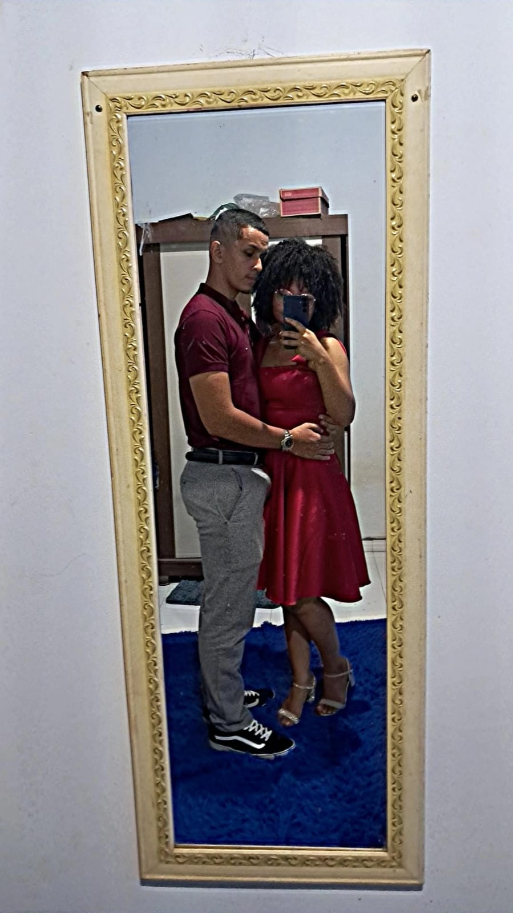

<html lang="pt-BR">
<head>
  <meta charset="UTF-8" />
  <meta name="viewport" content="width=device-width, initial-scale=1.0"/>
  <title>Nosso Amor</title>
  <link rel="stylesheet" href="https://cdnjs.cloudflare.com/ajax/libs/font-awesome/6.5.0/css/all.min.css" />
  
</head>
<body>

  <!-- Tela de Boas-vindas -->
  <section id="boas-vindas">
    <h1>Bem-vinda meu amor ❤️</h1>
    <button class="glow-button" onclick="irParaPrincipal()">
      <i class="fas fa-heart"></i> Entrar
    </button>
  </section>

  <!-- Tela Principal -->
  <section id="principal" style="display:none;">
    

      
      

        <strong>Congratulations</strong>
        Bilal
        <small id="statusMusica">⏸️ Pausado</small>
        <audio id="player" controls>
          <source src="congratulations.mp3" type="audio/mp3">
          Seu navegador não suporta áudio HTML5.
        </audio>
      

    

    

      <button class="carousel-button left" onclick="mudarFoto(-1)">❮</button>
      <button class="carousel-button right" onclick="mudarFoto(1)">❯</button>
      

        
        
        
        
        
        
        
        
        
        
      

      

    

    
    

      
<i class="fas fa-heart"></i> Eu te amo há:

      

  
      <!-- MENSAGEM ROMÂNTICA -->
      

        

          Parabéns, meu amor! 💖  
          Hoje é mais um daqueles dias em que meu coração se enche de gratidão por ter você ao meu lado. Sua presença ilumina minha vida, e cada momento contigo se torna inesquecível. Obrigado por ser minha inspiração, minha paz e meu abrigo.   
          Sua companhia é o que dá sentido a cada um dos meus dias. Você é minha melhor escolha, meu maior orgulho e o amor que sempre sonhei. Que essa data se repita por muitos e muitos anos, sempre com sorrisos, cumplicidade e muito amor.   
          Te amo mais do que palavras podem expressar. 💘  
          <strong>Eu te amo! ❤️</strong>
        

  
        

          "O amor é paciente, o amor é bondoso. Não inveja, não se vangloria, não se orgulha. Tudo sofre, tudo crê, tudo espera, tudo suporta."  
          – <strong>1 Coríntios 13:4,7</strong>
        

      

  
      

  

      

        "O amor é paciente, o amor é bondoso... – <strong>1 Coríntios 13:4,7</strong>"
      

    

    

  </section>

  
</body>
</html>
